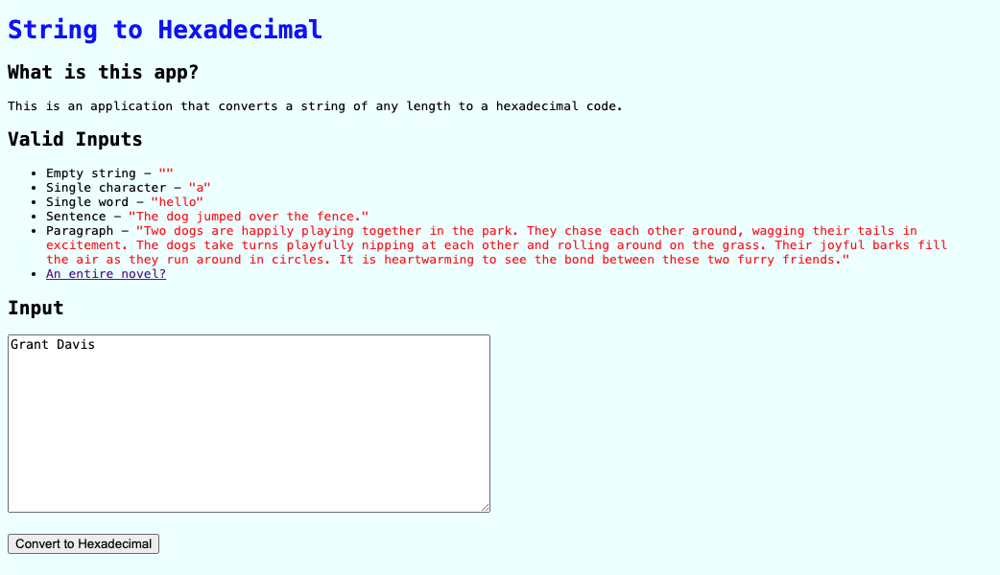

# String to Hex

### There is currently no live deployment of this application.

### About

This is an application that converts a string of any length to a hexadecimal code.

### Screenshots

**Example 1**




**Example 2**


### Setup

```
[Fork and clone this repository]

cd string_to_hex

bundle install
rails db:{drop,create,migrate,seed}
rails s

[Open LocalHost:3000]
```

### Versions

- Ruby 3.2.2
- Rails 7.1.3.4

### Tests

* 6 Total Tests (66 / 66 LOC (100.0%) covered)

**Testing Instructions**

```
rails db:{drop,create,migrate,seed}
bundle exec rspec spec

open coverage/index.html
```

### Resources

No resources used for this project.

### Contributors

* Grant Davis | [GitHub](https://github.com/grantdavis303), [LinkedIn](https://www.linkedin.com/in/grantdavis303/)